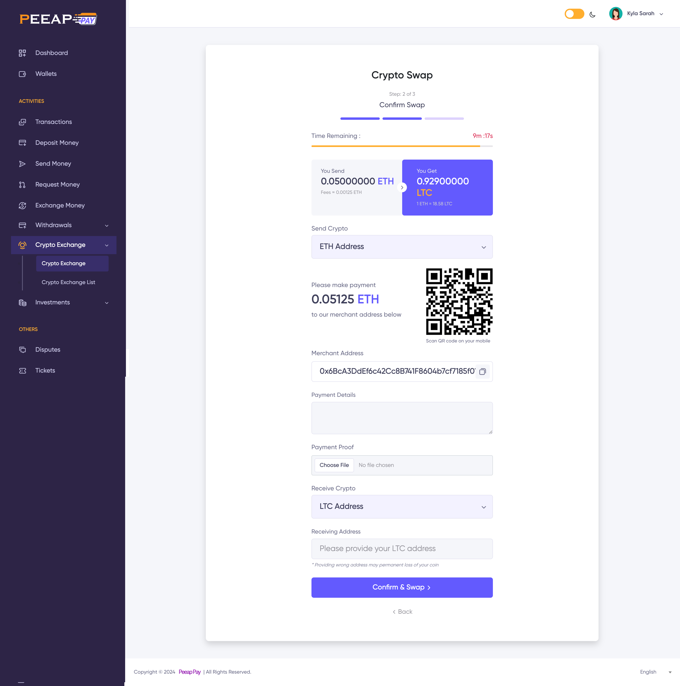

## Peeap Pay – CryptExchange
Peeap Pay – CryptExchange is an innovative, fast, and secure cryptocurrency exchange platform designed to allow users to swap, buy, and sell cryptocurrencies with ease. Whether you are registered or not, Peeap Pay’s exchange services are available to everyone, making it accessible and user-friendly for both experienced and new crypto users.

Key Features:
Crypto Swapping: Instantly swap various cryptocurrencies with ease.
Buy/Sell Crypto: Seamlessly buy and sell coins through secure, fast transactions.
No Account Required: Unregistered users can use the platform for exchanging via wallets or external addresses.
Multiple Payment Gateways: Choose from a wide range of payment gateways for added convenience.
Transaction Tracking: Users can track their transactions anytime, anywhere, with complete transparency.
Flexible Administrator Tools: Administrators have the freedom to create unlimited buy/sell/swap directions.
The Importance of a Crypto Swapping Exchange Platform for Sierra Leone
Cryptocurrency is fast becoming a global financial system, and Sierra Leone is poised to benefit significantly from adopting this technology. Peeap Pay – CryptExchange plays a crucial role in providing financial inclusion, economic growth, and secure investment opportunities for Sierra Leoneans.

1. Financial Inclusion
Sierra Leone faces challenges with traditional banking services, where access is limited, especially in rural areas. Peeap Pay – CryptExchange opens the doors to financial services for all, regardless of geographic location. Through mobile wallets and decentralized access to currency, individuals can participate in the global financial ecosystem, bypassing barriers that exist in traditional banking.

2. Economic Empowerment
Cryptocurrencies enable Sierra Leoneans to engage in international trade, investment, and remittances with minimal fees and delays. By facilitating the exchange of various digital assets, Peeap Pay allows users to leverage cryptocurrencies as a tool for wealth building and to access global markets.

3. Lower Transaction Costs
Traditional money transfer systems, particularly for cross-border payments, often charge high fees. Peeap Pay – CryptExchange offers a cost-effective alternative, making it easier for Sierra Leoneans to send and receive funds, trade, and make investments at a fraction of the cost of traditional systems.

4. Secure and Transparent Transactions
Blockchain technology ensures that all transactions carried out through Peeap Pay are secure and immutable. This transparency builds trust in the financial system and reduces the risk of fraud, a critical concern in regions with less developed financial infrastructures.

5. Instant Transactions
With Peeap Pay – CryptExchange, users can buy, sell, and swap crypto instantly, without having to wait for lengthy transaction processing times. This speed is particularly beneficial for business transactions and remittances, which require fast settlement.

6. Promotion of Innovation
The introduction of cryptocurrency trading in Sierra Leone encourages technological innovation, providing opportunities for tech-driven projects and new businesses in the fintech space. Peeap Pay aims to be at the forefront of this transformation, offering a platform for young entrepreneurs and innovators to explore the possibilities of blockchain technology.
